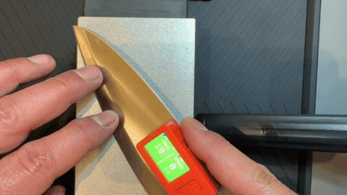

# Digital Sharpening Guide

**Turn a ~$20 M5StickC Plus into a live knife-sharpening angle coach.** It magnets straight onto the flat of your blade — the stick already has a magnet in its back — and the screen fills with color so you can *feel* your angle drift without looking up from the stone:

- 🟩 **Green** — you're holding the target angle
- 🟦 **Blue** — too low, raise the spine
- 🟥 **Red** — too high, lower the spine

Plus automatic per-side stroke counting (for balanced bevels), an optional out-of-tolerance buzzer, and an end-of-session summary.

[](LICENSE)

[](https://miamimoe.github.io/digital-sharpening-guide/)

> **New here from r/sharpening?** 👋 The fastest path: buy an **M5StickC Plus** + a small magnet (see [What you'll need](#what-youll-need)), then **[flash it in your browser](https://miamimoe.github.io/digital-sharpening-guide/)** — no coding required.

<p align="center">
  <a href="https://github.com/miamimoe/digital-sharpening-guide/releases/download/v0.1.0/digital-sharpening-guide-demo.mp4">
    
  </a>
</p>

_▶️ Holding the target angle on a whetstone — screen stays green. [Watch the full clip with sound »](https://github.com/miamimoe/digital-sharpening-guide/releases/download/v0.1.0/digital-sharpening-guide-demo.mp4) · Built in the open after folks on [r/sharpening](https://www.reddit.com/r/sharpening/) asked for the code._

---

## ⚠️ Read this first

This is a **hobby project at v0.1.0**, shared because people asked for it — not a precision instrument. It's a *coach to build muscle memory*, not a jig that holds the angle for you.

- It tells you where your angle is; **you** still do the sharpening. A bad reading won't cut you, but don't trust it blindly on an expensive knife until you've sanity-checked it against a protractor or a marker-on-the-bevel test.
- Stroke-count and filter thresholds are **still being tuned** against real sessions — counts may be off by a stroke or two. Feedback welcome (see [Contributing](#contributing)).
- Mind the edge: you're handling a sharp knife near a small electronic device. Go slow the first few passes.

---

## What you'll need

Basically just the stick — roughly **$20**. The M5StickC Plus already has a magnet in its back, so there's nothing else to buy.

| Item | What to get | Search terms | ~Cost |
|---|---|---|---|
| **The device** | **M5StickC Plus** (ESP32-PICO, 1.14" screen). ⚠️ Get the **"Plus"** — *not* the smaller original M5StickC, and *not* the "Plus2" (different power chip, won't work with this firmware yet). | `M5StickC PLUS ESP32` | $18–25 |
| **USB-C cable** | A **data** cable (not charge-only) to flash it. You probably already have one. | — | — |

> **That's the whole shopping list.** The M5StickC Plus has a magnet built into its back, so it sticks to a steel blade with nothing extra. *If your unit's built-in magnet doesn't grip firmly enough, glue on a small neodymium magnet (~10 × 5 mm N35, a ~$1 add-on) with 5-min epoxy or VHB tape.*
>
> **Why the M5StickC Plus specifically?** The firmware talks directly to *this* board's IMU (MPU6886), screen (ST7789V2) and power chip (AXP192). Other M5 sticks use different parts and won't run it correctly. If you already own a Plus, you're set.

---

## Mounting (nothing to build)

The M5StickC Plus has a magnet in its back, so there's no assembly: just **press it onto the flat of the blade, screen facing you**. No soldering, no glue, no wiring.

*Optional:* if the built-in magnet doesn't hold firmly on your knife, glue a small neodymium magnet (~10 × 5 mm N35) to the back with 5-minute epoxy or VHB tape.

---

## Flashing the firmware

### Option A — Flash in your browser (recommended, no tools)

1. Open **[miamimoe.github.io/digital-sharpening-guide](https://miamimoe.github.io/digital-sharpening-guide/)** in **desktop Chrome, Edge, or Opera** (Web Serial isn't supported on Safari, Firefox, or phones).
2. Plug the M5StickC Plus into your computer with a USB-C **data** cable.
3. Click **⚡ Flash it now**, pick the serial port (often shown as *CP2104 / USB Serial*), and hit **Install**.
4. If the device doesn't show up, install the [CP210x USB driver](https://www.silabs.com/developer-tools/usb-to-uart-bridge-vcp-drivers) and reconnect.

A prebuilt binary is also attached to every [GitHub Release](https://github.com/miamimoe/digital-sharpening-guide/releases) if you'd rather flash with `esptool` yourself (offset `0x0`).

### Option B — Build from source (for developers)

Requires [PlatformIO](https://platformio.org/install/cli):

```bash
git clone https://github.com/miamimoe/digital-sharpening-guide.git
cd digital-sharpening-guide

pio run -e m5stick-c-plus              # build
pio run -e m5stick-c-plus -t upload    # flash over USB
pio device monitor -b 115200           # serial log
pio test -e native                     # run the desktop unit tests
```

The only library dependency is M5Unified (pulled automatically).

---

## How to use it

Once flashed, the device walks you through everything on-screen. A full session:

1. **Power on.** You'll see a `SHARPENING GUIDE` splash, then `SET TARGET`.
2. **Set your target angle.** Either:
   - hold the device at the angle you want and press **A** to capture it, **or**
   - press **B** to cycle the presets (12° / 15° / 17° / 20° / 22°) and press **A** to pick one.
3. **Set tolerance.** Press **B** to cycle `TIGHT ±2°` / `NORMAL ±3°` / `EASY ±5°`, then **A** to confirm. (Start with NORMAL or EASY.)
4. **Zero-calibrate (2 quick steps).** This is what makes it angle-accurate regardless of how the device is rotated on the blade:
   - **Step 1/2 — "Lay flat on stone":** rest the blade flat on your stone, press **A**, hold still for the countdown.
   - **Step 2/2 — "Raise to your angle":** lift the spine to roughly your sharpening angle, press **A**, hold still.
   - *(If it says "KEEP STILL", just set it down for a second — or tap **B** to force the capture.)*
5. **Sharpen.** The whole screen turns **green / blue / red**. Chase green. The center number is your stroke count for the current side.
6. **Switch sides.** When you flip the knife to sharpen the other face, **press B** to switch the device to the other side — that side's stroke count picks up where it left off. *(If the angle reads off after re-mounting, short-press **A** to re-zero in place.)*
7. **End the session.** **Long-press A** → `SESSION` summary (target, tolerance, strokes per side, time). Press **A** for a new session, or **B** to sleep.

### Controls

| Button | Short press | Long press |
|---|---|---|
| **A** (front) | confirm / capture / re-zero | **end session** (→ summary) |
| **B** (side) | cycle option / switch blade side | **toggle buzzer** |
| **Power** (left side) | sleep / wake | hold 6 s = full power-off |

---

## How it works

- **Edge-axis bevel measurement.** The two-step zero calibration captures both a flat reference *and* the cutting-edge hinge axis. The bevel angle is measured as rotation *about that axis*, so tip-to-heel skew doesn't inflate the reading and a single calibration serves both faces of the blade.
- **Mahony AHRS filter** fuses gyro + accelerometer at 50 Hz, with per-session gyro-bias capture and a snap-to-raw recovery when the device is verifiably still.
- **Motion-based stroke counting.** Passes are detected as horizontal linear-acceleration peaks (with hysteresis + a refractory interval) while you're on-angle — not from angle-dwell timing.
- **Battery-aware.** Deep sleep on idle with the session preserved in RTC RAM (wake resumes where you left off), screen dimming, an 80 MHz CPU clock, and a one-click sleep/wake power key. Figure on roughly an hour or two of continuous use on the small ~120 mAh cell (untuned — your mileage will vary).

More detail lives in [`docs/`](docs/) — the design spec, implementation plan, and hardware bring-up checklist.

## Repo layout

```
src/        firmware modules — app state machine, angle math, Mahony filter,
            stroke/side/input FSMs, zero-cal capture, UI, power, persistence
test/       native (desktop) unit tests for the pure-logic modules
docs/       design spec, bring-up checklist, and the browser-flasher page
```

## Troubleshooting

| Symptom | Fix |
|---|---|
| Browser flasher can't see the device | Use desktop Chrome/Edge/Opera, try a different **data** USB-C cable, and install the [CP210x driver](https://www.silabs.com/developer-tools/usb-to-uart-bridge-vcp-drivers). |
| Screen stuck on **"KEEP STILL"** during calibration | Set the device down on the bench for a second so it can capture — or tap **B** to force the capture. |
| Angle reads wrong / drifted after re-mounting or flipping the knife | Short-press **A** to re-zero in place. |
| `IMU FAULT` on boot | Power-cycle. If it persists, re-flash; this is the documented MPU6886/AXP192 I²C quirk — see [`docs/`](docs/). |
| Stroke count is off by a few | Expected at v0.1.0 — thresholds are still being tuned. Please send your numbers (see [Contributing](#contributing)). |

## Known limitations (v0.1.0)

- Stroke-count and Mahony `kp/ki` thresholds are first-pass guesses still being tuned on real stones.
- No companion app, BLE, or logging by design — it's meant to be a glanceable, standalone coach.
- Tested on the original **M5StickC Plus** only.

## Contributing

Issues and PRs welcome — especially **real-world tuning data** (your hand-counted strokes vs. what the device reported, knife/stone/angle). That's the single most useful thing right now. Open an [issue](https://github.com/miamimoe/digital-sharpening-guide/issues) with what worked, what didn't, and your hardware. See [CONTRIBUTING.md](CONTRIBUTING.md).

## License

[MIT](LICENSE) © 2026 Another Dumb Idea, LLC. Do whatever you like with it — build one, mod it, sell your own version. Attribution appreciated, not required.
