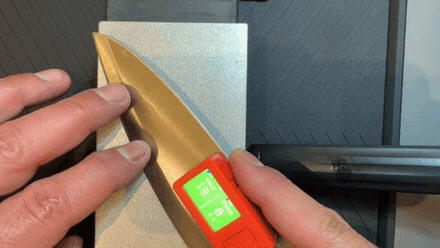

# Digital Sharpening Guide

**Turn a ~$20 M5StickC Plus into a live knife-sharpening angle coach.** It magnets straight onto the flat of your blade — the stick already has a magnet in its back — and the screen fills with color so you can *feel* your angle drift without looking up from the stone:

- 🟩 **Green** — you're holding the target angle
- 🟦 **Blue** — too low, raise the spine
- 🟥 **Red** — too high, lower the spine

Plus automatic per-side stroke counting (for balanced bevels), an optional out-of-tolerance buzzer, and an end-of-session summary.

[](LICENSE)

[](https://miamimoe.github.io/digital-sharpening-guide/)

> **New here from r/sharpening?** 👋 The fastest path: pick a supported device (see [What you'll need](#what-youll-need)), then **[flash it in your browser](https://miamimoe.github.io/digital-sharpening-guide/)** — no coding required.

<p align="center">
  <a href="https://github.com/miamimoe/digital-sharpening-guide/releases/download/v0.1.0/digital-sharpening-guide-demo.mp4">
    
  </a>
</p>

_▶️ Holding the target angle on a whetstone — screen stays green. [Watch the full clip with sound »](https://github.com/miamimoe/digital-sharpening-guide/releases/download/v0.1.0/digital-sharpening-guide-demo.mp4) · Built in the open after folks on [r/sharpening](https://www.reddit.com/r/sharpening/) asked for the code._

---

## What's new in v0.2.1

- **Two more angle presets: 25° and 28°** — the common sharpen/deburr pair for Chinese chef knives. `B` now cycles **12° / 15° / 17° / 20° / 22° / 25° / 28° / CANCEL**. Requested by a user sharpening on an S3, where the presets are the quickest way in.
- Boot splash now shows the real firmware version (it had been stuck reading `v0.1.0`).
- Build dependencies pinned to exact versions so a given release rebuilds byte-for-byte instead of drifting with upstream.

[**⚡ Flash the update in your browser**](https://miamimoe.github.io/digital-sharpening-guide/) — takes about a minute, no tools needed.

---

## 🧪 Beta: steady mode — testers wanted

If the live angle number jumps around while you sharpen, there's a beta that goes after exactly that.

A sharpening stroke pushes the blade **sideways**, and the filter's guard against that was nearly blind to it: 0.18 g of sweep — the level the firmware already counts as a stroke — tilted its gravity reference **10.2°** while barely changing its magnitude, so it sailed through unrejected. The beta averages the gravity reference before it steers the angle (stroke acceleration cancels out over a cycle, gravity doesn't) and stops the displayed number and the colour from flip-flopping on sub-degree noise. Simulated, that's **2.3–4× steadier** depending on how fast you stroke.

**You can switch it on and off on the device** — hold **B** on the TOLERANCE screen — so you can compare it against the old behaviour on the same knife, same stone, in the same session.

The beta also adds three things worth trying:

- **Accuracy check** — hold **A** on SET TARGET. Lay the device flat, press **A**, then stand it on a known angle and read the number at 0.1°. Answers "is this thing actually right?" in about twenty seconds. There are [printable wedges](https://miamimoe.github.io/digital-sharpening-guide/angle-check.html) if you don't own an angle block.
- **Time on-angle** — the session summary now shows what share of the session you held inside tolerance. Stroke count says how much you did; this says how well, and it's the number that should climb as your technique does.
- **Past sessions** — hold **B** on the summary screen for your last five.

[**🧪 Flash the beta →**](https://miamimoe.github.io/digital-sharpening-guide/beta.html) · it hasn't run on real hardware yet, which is the whole reason it's a beta. The [normal flasher](https://miamimoe.github.io/digital-sharpening-guide/) puts the stable release back whenever you want.

**What would help most:** does the number actually sit still, and does green still arrive *fast enough*? Smoothing always trades response for calm — if green now feels late, that's the thing worth telling me. [Open an issue](https://github.com/miamimoe/digital-sharpening-guide/issues) either way.

---

## It doesn't care how you stuck it on

This is the part that makes the number trustworthy, and it's easy to miss because it looks like setup friction.

Most digital angle gauges measure **raw tilt**. Stick one on a blade even slightly skewed — rotated a few degrees toward the tip — and the number is wrong, with nothing on screen to tell you. You'd have to notice by feel.

The two-step calibration captures a flat reference *and* the cutting edge's hinge axis, then measures the bevel as rotation **about that axis**. Lengthwise skew drops out of the maths entirely. A crooked mount reads the same as a straight one, and one calibration serves both faces of the blade — flip the knife, keep sharpening.

That's why there are two steps instead of one. It's not setup; it's the reason the reading means something.

---

## ⚠️ Read this first

This is a **hobby project at v0.2.1**, shared because people asked for it — not a precision instrument. It's a *coach to build muscle memory*, not a jig that holds the angle for you.

- It tells you where your angle is; **you** still do the sharpening. Don't trust it blindly on an expensive knife until you've checked it — the beta has a built-in **accuracy check** (hold **A** on SET TARGET) and there are [printable angle wedges](https://miamimoe.github.io/digital-sharpening-guide/angle-check.html) to check it against.
- Stroke-count and filter thresholds are **still being tuned** against real sessions — counts may be off by a stroke or two. Feedback welcome (see [Contributing](#contributing)).
- Mind the edge: you're handling a sharp knife near a small electronic device. Go slow the first few passes.

---

## What you'll need

Basically just the stick — roughly **$20**. The M5StickC Plus already has a magnet in its back, so there's nothing else to buy.

| Item | What to get | Search terms | ~Cost |
|---|---|---|---|
| **The device — pick one** | Three boards are supported. ⚠️ *Not* the original **M5StickC** (non-Plus, smaller ST7735 screen) — that model is not supported. | — | — |
| M5StickC **Plus** ✅ | Fully validated on real hardware. ESP32-PICO, MPU6886, 1.14" ST7789V2, AXP192, passive buzzer. | `M5StickC Plus ESP32` | $18–25 |
| M5StickC **Plus2** ⚠️ | Compile-verified + code-reviewed against M5Stack datasheets; needs a community tester — please flash and open an issue. ESP32-PICO-V3-02, MPU6886, same screen, no PMIC, passive buzzer. | `M5StickC Plus2` | $20–28 |
| **M5StickS3** ⚠️ | Compile-verified + code-reviewed against M5Stack datasheets; needs a community tester — please flash and open an issue. ESP32-S3, BMI270, same screen, M5PM1 PMIC, codec speaker. | `M5StickS3` | $25–35 |
| **USB-C cable** | A **data** cable (not charge-only) to flash it. You probably already have one. | — | — |

> **That's the whole shopping list.** All three supported sticks have a magnet built into their back, so they stick to a steel blade with nothing extra. *If your unit's built-in magnet doesn't grip firmly enough, glue on a small neodymium magnet (~10 × 5 mm N35, a ~$1 add-on) with 5-min epoxy or VHB tape.*
>
> **Why these three M5Stick models?** From v0.2.0 the firmware is board-guarded at compile time (`src/board.h`, build flag `SG_BOARD_*`): each board gets its own binary, built from one codebase, that adapts to its IMU (MPU6886 on Plus/Plus2, BMI270 on S3), power management (AXP192 on Plus, G4 hold-pin on Plus2, M5PM1 on S3), and status LED pin. If you accidentally flash the wrong binary, the firmware shows a red **WRONG FIRMWARE** screen instead of misbehaving silently. If you already own a Plus, you're set. If you have a Plus2 or S3 — please try it and [report back](https://github.com/miamimoe/digital-sharpening-guide/issues).
>
> **Board support status:** M5StickC **Plus** — validated on real hardware. M5StickC **Plus2** and **M5StickS3** — compile-verified and code-reviewed against the M5Stack datasheets, but **not yet confirmed on a physical device** (the maintainer does not own them). All three share one codebase. If you have a Plus2 or S3, please flash it and open a [GitHub issue](https://github.com/miamimoe/digital-sharpening-guide/issues) with your results.

---

## Mounting (nothing to build)

The M5StickC Plus has a magnet in its back, so there's no assembly: just **press it onto the flat of the blade, screen facing you**. No soldering, no glue, no wiring.

*Optional:* if the built-in magnet doesn't hold firmly on your knife, glue a small neodymium magnet (~10 × 5 mm N35) to the back with 5-minute epoxy or VHB tape.

---

## Flashing the firmware

### Option A — Flash in your browser (recommended, no tools)

1. Open **[miamimoe.github.io/digital-sharpening-guide](https://miamimoe.github.io/digital-sharpening-guide/)** in **desktop Chrome, Edge, or Opera** (Web Serial isn't supported on Safari, Firefox, or phones).
2. Plug your device into your computer with a USB-C **data** cable.
3. **Select your board** from the device picker (M5StickC Plus / Plus2 / S3), then click **⚡ Flash it now**, pick the serial port (often shown as *CP2104 / USB Serial*), and hit **Install**.
4. If the device doesn't show up, install the [CP210x USB driver](https://www.silabs.com/developer-tools/usb-to-uart-bridge-vcp-drivers) and reconnect.

A prebuilt binary is also attached to every [GitHub Release](https://github.com/miamimoe/digital-sharpening-guide/releases) if you'd rather flash with `esptool` yourself (offset `0x0`).

### Option B — Build from source (for developers)

Requires [PlatformIO](https://platformio.org/install/cli):

```bash
git clone https://github.com/miamimoe/digital-sharpening-guide.git
cd digital-sharpening-guide

pio run -e m5stick-c-plus              # build for M5StickC Plus
pio run -e m5stick-c-plus2             # build for M5StickC Plus2
pio run -e m5stick-s3                  # build for M5StickS3

pio run -e m5stick-c-plus -t upload    # flash over USB (change -e for your board)
pio device monitor -b 115200           # serial log
pio test -e native                     # run the desktop unit tests
```

The only library dependency is M5Unified (pulled automatically).

---

## How to use it

Once flashed, the device walks you through everything on-screen. A full session:

1. **Power on.** You'll see a `SHARPENING GUIDE` splash, then `SET TARGET`.
2. **Set your target angle.** Either:
   - hold the device at the angle you want and press **A** to capture it, **or**
   - press **B** to cycle the presets (12° / 15° / 17° / 20° / 22° / 25° / 28°) and press **A** to pick one.
3. **Set tolerance.** Press **B** to cycle `TIGHT ±2°` / `NORMAL ±3°` / `EASY ±5°`, then **A** to confirm. (Start with NORMAL or EASY.)
4. **Zero-calibrate (2 quick steps).** This is what makes it angle-accurate regardless of how the device is rotated on the blade:
   - **Step 1/2 — "Lay flat on stone":** rest the blade flat on your stone, press **A**, hold still for the countdown.
   - **Step 2/2 — "Raise to your angle":** lift the spine to roughly your sharpening angle, press **A**, hold still.
   - *(If it says "KEEP STILL", just set it down for a second — or tap **B** to force the capture.)*
5. **Sharpen.** The whole screen turns **green / blue / red**. Chase green. The center number is your stroke count for the current side.
6. **Switch sides.** When you flip the knife to sharpen the other face, **press B** to switch the device to the other side — that side's stroke count picks up where it left off. *(If the angle reads off after re-mounting, short-press **A** to re-zero in place.)*
7. **End the session.** **Long-press A** → `SESSION` summary (target, tolerance, strokes per side, time). Press **A** for a new session, or **B** to sleep.

### Controls

| Button | Short press | Long press |
|---|---|---|
| **A** (front) | confirm / capture / re-zero | **end session** (→ summary) |
| **B** (side) | cycle option / switch blade side | **toggle buzzer** |
| **Power** (left side) | sleep / wake | hold 6 s = full power-off (AXP192 / Plus only — see note below) |


> ⚠️ The "hold 6 s = full power-off" behavior is AXP192-specific and applies to the **M5StickC Plus** only. On the **Plus2** and **S3**, the power button is managed by the board's own power IC through M5Unified; the long-hold power-off behavior may differ slightly.

---

## How it works

- **Edge-axis bevel measurement.** The two-step zero calibration captures both a flat reference *and* the cutting-edge hinge axis. The bevel angle is measured as rotation *about that axis*, so tip-to-heel skew doesn't inflate the reading and a single calibration serves both faces of the blade.
- **Mahony AHRS filter** fuses gyro + accelerometer at 50 Hz, with per-session gyro-bias capture and a snap-to-raw recovery when the device is verifiably still.
- **Motion-based stroke counting.** Passes are detected as horizontal linear-acceleration peaks (with hysteresis + a refractory interval) while you're on-angle — not from angle-dwell timing.
- **Battery-aware.** Idle sleep, screen dimming, an 80 MHz CPU clock, and a one-click power key. On the **Plus/Plus2** this is a true deep sleep with the session preserved in RTC RAM, so waking resumes where you left off. On the **M5StickS3** the power button is owned by the M5PM1 PMIC (not a wake-capable GPIO), so the device fully powers off instead — a power-key press turns it back on with a fresh boot (the in-progress session isn't resumed on the S3). Figure on roughly an hour or two of continuous use on the small cell (untuned — your mileage will vary).

More detail lives in [`docs/`](docs/) — the design spec, implementation plan, and hardware bring-up checklist.

## Repo layout

```
src/        firmware modules — app state machine, angle math, Mahony filter,
            stroke/side/input FSMs, zero-cal capture, UI, power, persistence
test/       native (desktop) unit tests for the pure-logic modules
docs/       design spec, bring-up checklist, and the browser-flasher page
```

## Troubleshooting

| Symptom | Fix |
|---|---|
| Browser flasher can't see the device | Use desktop Chrome/Edge/Opera, try a different **data** USB-C cable, and install the [CP210x driver](https://www.silabs.com/developer-tools/usb-to-uart-bridge-vcp-drivers). |
| Screen stuck on **"KEEP STILL"** during calibration | Set the device down on the bench for a second so it can capture — or tap **B** to force the capture. |
| Angle reads wrong / drifted after re-mounting or flipping the knife | Short-press **A** to re-zero in place. |
| `IMU FAULT` on boot | Power-cycle. If it persists, re-flash; this is the documented MPU6886/AXP192 I²C quirk — see [`docs/`](docs/). |
| Stroke count is off by a few | Expected at v0.2.1 — thresholds are still being tuned. Please send your numbers (see [Contributing](#contributing)). |

## Known limitations (v0.2.1)

- Stroke-count and Mahony `kp/ki` thresholds are first-pass guesses still being tuned on real stones.
- No companion app, BLE, or logging by design — it's meant to be a glanceable, standalone coach.
- **Board support:** the **M5StickC Plus** is validated on real hardware. The **M5StickC Plus2** and **M5StickS3** are compile-verified and code-reviewed against M5Stack datasheets, but not yet confirmed on a physical device — if you own one, please flash it and open a [GitHub issue](https://github.com/miamimoe/digital-sharpening-guide/issues) with results.

## Contributing

Issues and PRs welcome — especially **real-world tuning data** (your hand-counted strokes vs. what the device reported, knife/stone/angle). That's the single most useful thing right now. Open an [issue](https://github.com/miamimoe/digital-sharpening-guide/issues) with what worked, what didn't, and your hardware. See [CONTRIBUTING.md](CONTRIBUTING.md).

## License

[MIT](LICENSE) © 2026 Another Dumb Idea, LLC. Do whatever you like with it — build one, mod it, sell your own version. Attribution appreciated, not required.
